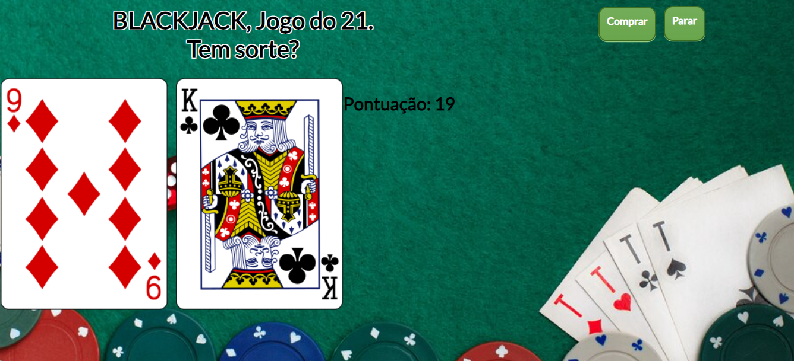
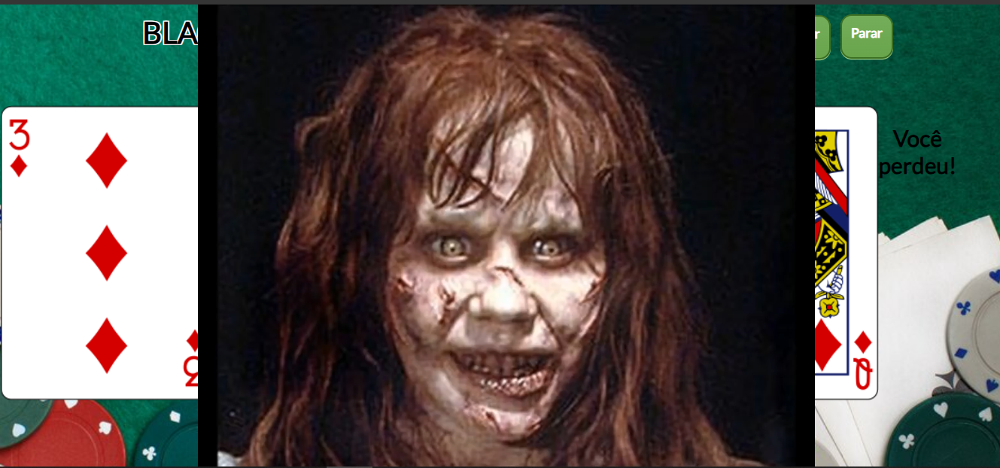

# JOGO DO 21 COM HTML
👨‍🏫O BLACKJACK É UM JOGO DE HABILIDADE E SORTE, COM UM EQUILÍBRIO ENTRE A ESTRATÉGIA DE JOGO E O ELEMENTO ALEATÓRIO DAS CARTAS.

   
   

## DESCRIÇÃO:
O Blackjack, também conhecido como 21, é um jogo de cartas popular em cassinos e entre jogadores casuais. Aqui estão os principais detalhes sobre o jogo:

- O objetivo do Blackjack é obter uma mão de cartas cuja pontuação total seja a mais próxima possível de 21, sem ultrapassar esse valor.
- O jogador compete contra o dealer (ou croupier), não contra outros jogadores.

## REGRAS DO JOGO:
1. **Distribuição das Cartas:**
   - No início do jogo, tanto o jogador quanto o dealer recebem duas cartas.
   - As cartas do jogador são geralmente mostradas viradas para cima.
   - O dealer recebe uma carta virada para cima e uma carta virada para baixo (outra conhecida como "carta oculta").

2. **Valores das Cartas:**
   - **Cartas Numéricas (2 a 10):** Valem seu valor nominal.
   - **Cartas de Figuras (Valete, Dama, Rei):** Valem 10 pontos.
   - **Ás:** Pode valer 1 ou 11 pontos, dependendo de qual valor for mais vantajoso para a mão do jogador.

3. **Ações do Jogador:**
   - **Pedir (Hit):** O jogador pode solicitar cartas adicionais para tentar chegar mais perto de 21.
   - **Parar (Stand):** O jogador pode optar por não pedir mais cartas e manter a pontuação atual.
   - **Dobrar (Double Down):** O jogador pode dobrar sua aposta e receber apenas uma carta adicional.
   - **Dividir (Split):** Se o jogador receber duas cartas do mesmo valor, ele pode dividi-las em duas mãos separadas, cada uma com sua própria aposta adicional.

4. **Regras do Dealer:**
   - O dealer deve seguir regras rígidas sobre quando pedir ou parar. Normalmente, o dealer deve pedir cartas até atingir pelo menos 17 pontos e parar em 17 ou mais.

5. **Vitória e Derrota:**
   - **Vitória:** O jogador vence se a pontuação da mão for mais próxima de 21 do que a do dealer, sem ultrapassar 21.
   - **Derrota:** O jogador perde se a pontuação da mão ultrapassar 21 (conhecido como "estourar").
   - **Empate (Push):** Se o jogador e o dealer tiverem a mesma pontuação (sem ultrapassar 21), o jogador geralmente recupera sua aposta, mas não ganha nada extra.

## COMO JOGAR?
1. **Objetivo:**
   - O objetivo do Blackjack é obter uma pontuação total de cartas que seja o mais próximo possível de 21, sem ultrapassar esse valor.

2. **Regras Básicas:**
   - **Valores das Cartas:**
     - As cartas de 2 a 10 valem seu valor nominal.
     - As cartas de figuras (Rei, Dama, Valete) valem 10 pontos cada.
     - O Ás pode valer 1 ou 11 pontos, dependendo do que for mais vantajoso para o jogador.
   - **Jogando:**
     - O jogador pode clicar no botão "Comprar" para receber uma nova carta do baralho. Cada carta adiciona um valor à pontuação total do jogador.
     - O jogador pode clicar no botão "Parar" para encerrar a sua vez e finalizar a jogada.

3. **Condições de Vitória e Derrota:**
   - **Vitória:** Se a pontuação do jogador chegar exatamente a 21 com as cartas recebidas, o jogador ganha automaticamente.
   - **Derrota:** Se a pontuação do jogador ultrapassar 21, o jogador perde o jogo.

4. **Comportamento do Código:**
   - **Comprar Carta:** Quando o jogador clica no botão "Comprar", uma nova carta é retirada do baralho e exibida na tela. A pontuação do jogador é atualizada com o valor dessa carta.
   - **Parar:** Quando o jogador clica no botão "Parar", o jogo é encerrado, e o jogador não pode mais comprar cartas.
   - **Resultado do Jogo:** Se a pontuação do jogador ultrapassar 21, um vídeo de "derrota" é exibido e o jogo é encerrado. Se o jogador alcançar exatamente 21, o resultado é atualizado para "Você ganhou!" e o jogo também é encerrado.

## NÃO SABE?
- Entendemos que para manipular arquivos em `HTML`, `CSS` e outras linguagens relacionadas, é necessário possuir conhecimento nessas áreas. Para auxiliar nesse aprendizado, oferecemos cursos gratuitos disponíveis:
* [CURSO DE HTML E CSS](https://github.com/VILHALVA/CURSO-DE-HTML-E-CSS)
* [CURSO DE JAVASCRIPT](https://github.com/VILHALVA/CURSO-DE-JAVASCRIPT)
* [CONFIRA MAIS CURSOS](https://github.com/VILHALVA?tab=repositories&q=+topic:CURSO)

## CREDITOS:
- [PROJETO CRIADO PELO "diwalker"](https://github.com/diwalker/21)
- [PROJETO EDITADO PELO VILHALVA](https://github.com/VILHALVA)
